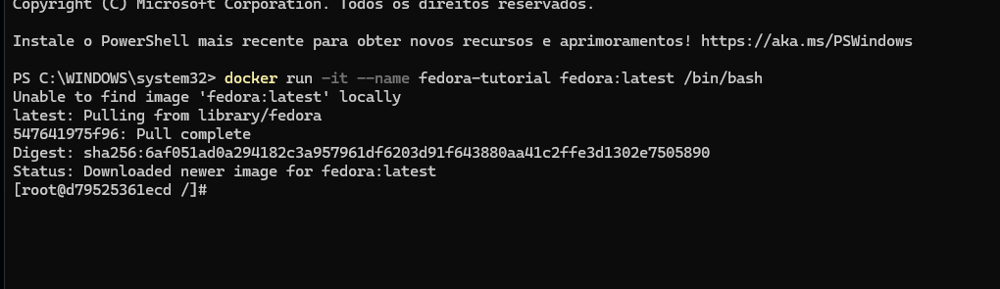
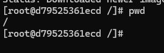
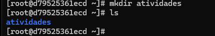
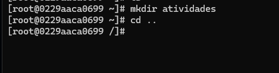
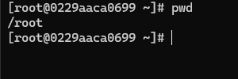
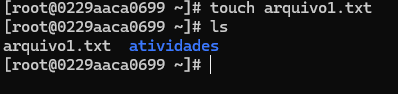
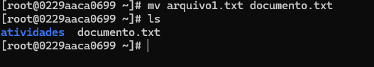

# Relatório de atividade - SO

## Informações gerais

## Atividade 2.2.1 – Iniciar um contêiner Fedora

### Passo 1 – Comando inicial
Executei o comando para baixar a imagem do Fedora e iniciar um contêiner interativo.

---

### Passo 2 – Verificando diretório atual
Verificando diretório atual. O símbolo `#` indica que estou na raiz.

---

### Passo 3 – Acessando home e listando arquivos
Usei `cd ~` para acessar a pasta **home** e `ls` para listar os arquivos dessa pasta. A pasta estava vazia.

---

### Passo 4 – Criando pasta "atividade"
Criei a pasta **atividade** dentro de **home** e listei novamente.

---

### Passo 5 – Voltando para a raiz
Voltei para a pasta raiz.

##  Atividade 2.2.3. – Modificar arquivos trabalhando na home e subpastas

### Passo 1 - Acessar e verificar se está na 
Entrei na pasta **home**

---

### Passo 2 - Criando arquivo .txt na home e verificando se foi realmente criado
Criei o arquivo arquivo1.txt na **home** e em seguida listei os arquivos.

---

### Passo 3 - Renomeando arquivo .txt
Renomeei o arquivo **arquivo1.txt** para **documento.txt** e listei os arquivos da pasta **home**

---