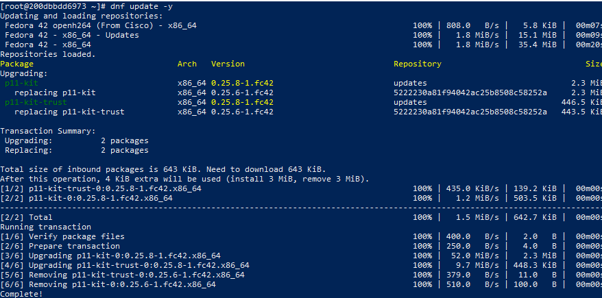
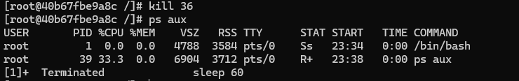

# Relatório de atividade - Sistemas Operacionais

Aluna: Fernanda Dantas do Nascimento
Data: 18/09/2025

# Introdução

Este relatório tem como objetivo descrever a realização de comandos básicos do Linux e Docker, visando promover familiaridade com os ambientes.

# Relato

## Atividade 2.2.1 – Iniciar um contêiner Fedora

Passo 1 – Comando inicial
Executei o comando para baixar a imagem do Fedora e iniciar um contêiner interativo.

---

Passo 2 – Verificando diretório atual
Verificando diretório atual. O símbolo `#` indica que estou na raiz.

---

Passo 3 – Acessando home e listando arquivos
Usei `cd ~` para acessar a pasta **home** e `ls` para listar os arquivos dessa pasta. A pasta estava vazia.

---

Passo 4 – Criando pasta "atividade"
Criei a pasta **atividade** dentro de **home** e listei novamente.

---

Passo 5 – Voltando para a raiz
Voltei para a pasta raiz.

## Atividade 2.2.3. – Modificar arquivos trabalhando na home e subpastas

Passo 1 - Acessar e verificar se está na 
Entrei na pasta **home**

---

Passo 2 - Criando arquivo .txt na home e verificando se foi realmente criado
Criei o arquivo arquivo1.txt na **home** e em seguida listei os arquivos.

---

Passo 3 - Renomeando arquivo .txt
Renomeei o arquivo **arquivo1.txt** para **documento.txt** e listei os arquivos da pasta **home**

---

Passo 4 - Acesso da pasta atividades e criação de subpasta

Dentro da pasta **atividades**, foi criado a subpasta **backup**

---

Passo 5 - copia do arquivo **documentos.txt** do **home** para a subpasta **backup**

Dentro da pasta **atividades/backup** foi feito uma copia do arquivo **documento.txt**.

---

Passo 6 - Voltando para a raíz

---

Passo 7 - Excluindo documento copiado

Excluí **documento.txt** da raíz e, após isso, verifiquei arquivos da raíz.

---

Passo 8 - listando arquivos da subpasta backup.

Após a exclusão do arquivo **documento.txt** na home, foi verificado se o arquivo ainda estava copiado na subpasta **backup**.

---

## Atividade 2.2.4 – Gerenciamento de pacote

Passo 1 - Atualização de lista de pacotes

Atualizando a lista de pacotes para realizar a atividade 2.2.4

---

Passo 2 - Instalação do nano

Instalação do editor de texto nano

---

Passo 3 - Remoção do nano

Remoção do editor de texto nano

--- 

## 2.2.5 – Permissões de arquivo

Passo 1 - Modificando permissões do arquivo script.sh

---

### 2.2.6 - Processos em execução

Passo 1 - Listagem de processos em execução

Listagem de comandos em execução

---

Passo 2 - Encerrando processo 

## 2.2.7 - Saindo e encerrando container Fedora

Passo 1 - Saindo e encerrando container Fedora

---

# Conclusão

